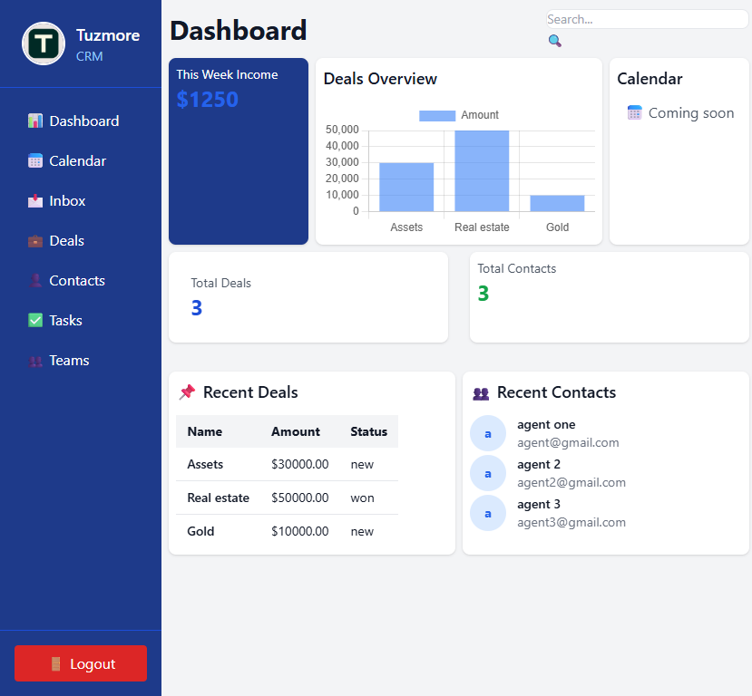

# Tuzmore CRM 
**Moden, dockerized SaaS platform with JWT authentication, user roles
admin, manager and sales. API intergartions, Swagger API docs and redoc.

## ⭐ Features
- Responsive dashboard with analytics  and charts
- JWT-based user authentication & secure login
- Use roles & permissions (Admin, Manager, and Sales)
- CRUD for deals , contacts and inbox
- Dockerized backend and API for easy deployment
- Search and filter functionality
- Mobile-friendly design(dashboard)

## Tech Stack
| Layer | Technology|
|-------|-----------|
| Backend | Python, Django, Django REST Framework |
| Authentication | JWT , User Roles & Permissions |
| Fronted | HTML, Tailwind CSS , JS & Chart.js |
| Containerization | Docker, Docker Compose |
| Databasa | SQL / PostgreSQL |
